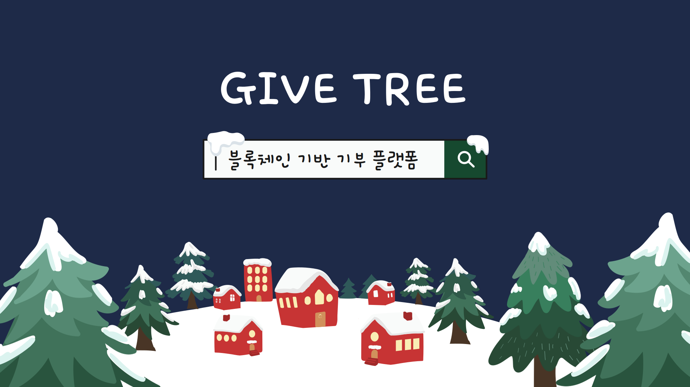

### 프로젝트 개요

---

SSAFY 11기 2학기 자율 프로젝트

2024년 10월 14일 ~ 2024년 11월 19일

 

### 서비스 소개

---

**블록체인 기술을 활용하여 기부금 사용의 투명성을 보장하고,** 

**중고거래 연계를 통해 쉽게 기부에 참여할 수 있는 편리한 기부 플랫폼**

 

### 🎄서비스명 & 로고

---
   **: GIVE(주다, 기부) + TREE(성장, 상생)**

### ❔ 프로젝트 기획 배경

---

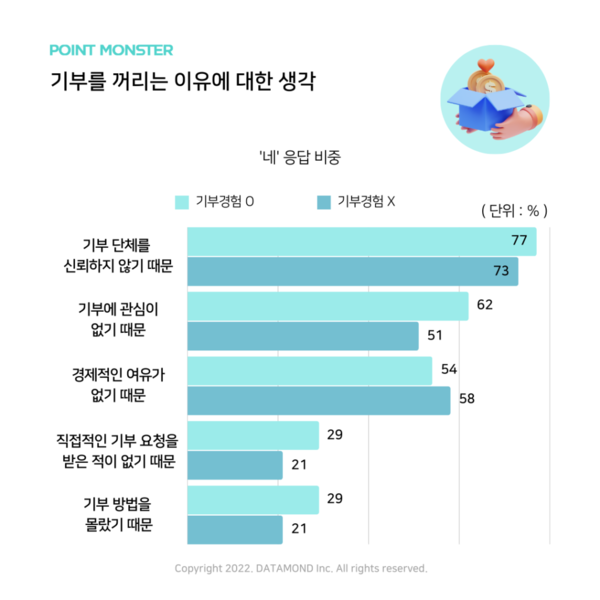
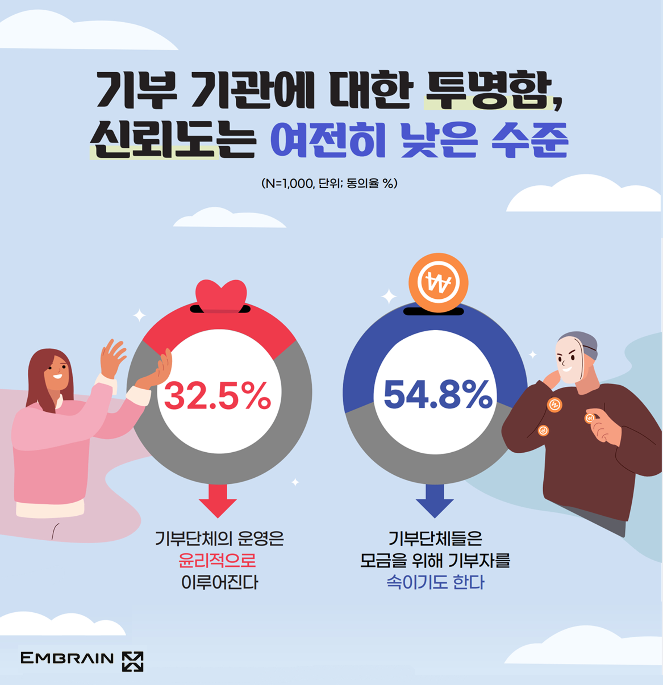

 

### ✨ 프로젝트 목표

---

1. 블록체인의 투명성을 도입하여 기부 신뢰도 상승
2. 간접적인 기부 시스템으로 기부 참여 유도
3. 캠페인 활성화 및 기부 문화 확산

 

### 주요 기능

---

### 💳 계좌 연동을 통한 간편한 기부

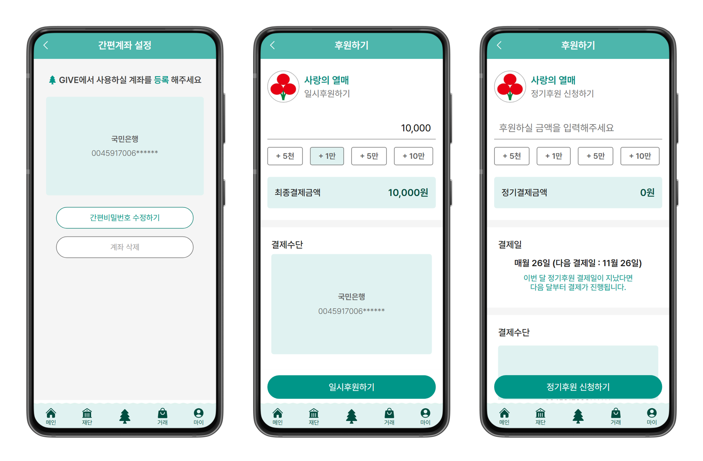

### :droplet: 기부 내역의 투명한 공유

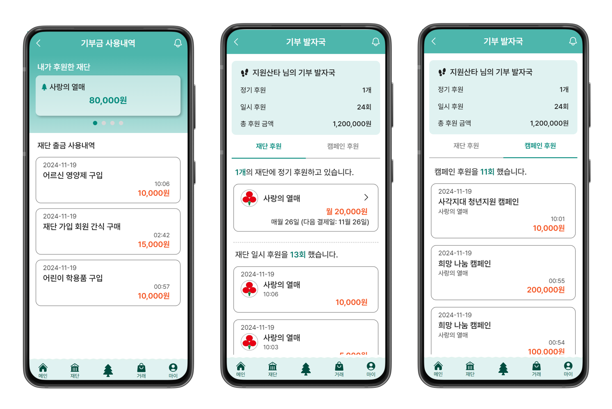

### 🛍️ 물품 판매 수익금의 일부 기부

### 🎄 캠페인 개설 및 트리 응원 메세지

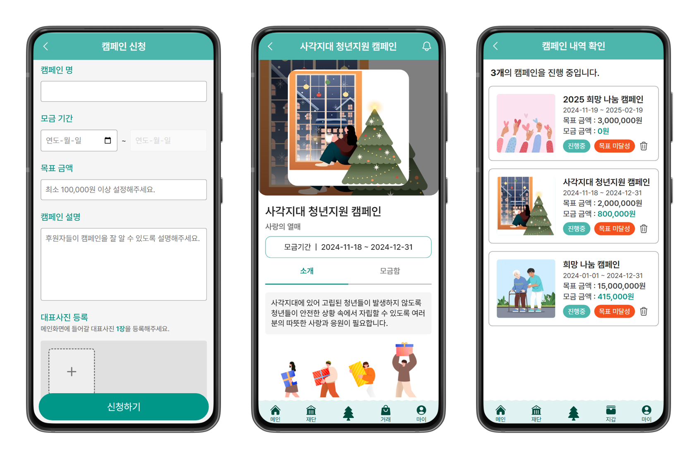
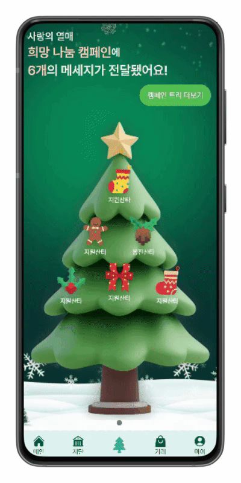

 

### 기술 스택

---

**[FE]**

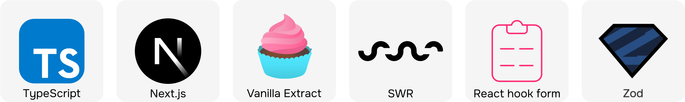

**[BE]**

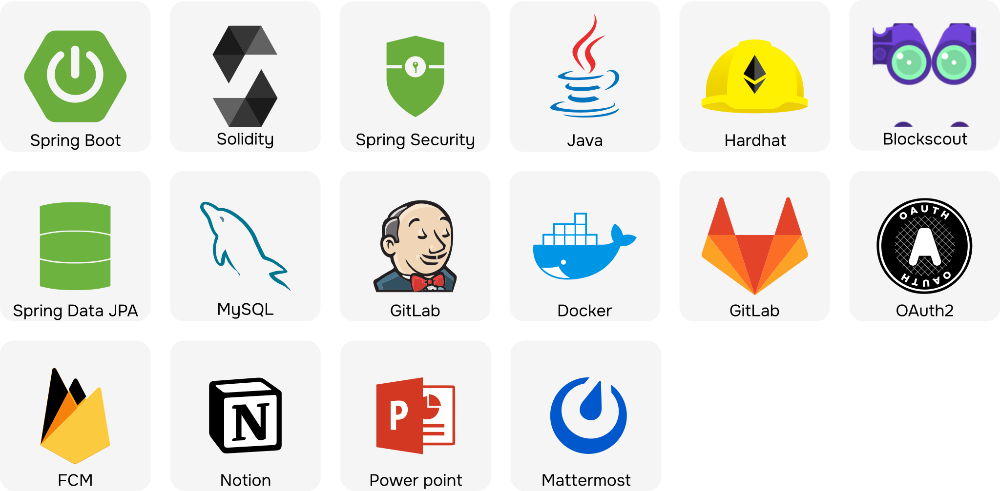

 

### 아키텍처

---

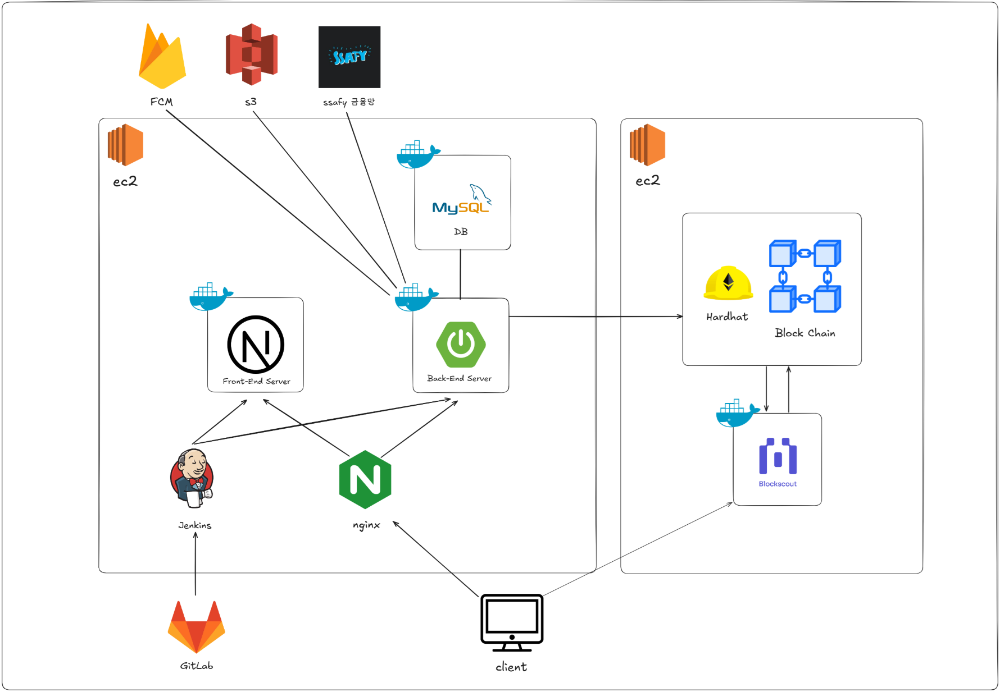

 

### 🧑‍🤝‍🧑 다르다 팀원 소개

----

### 프론트엔드

| 조소연 | 윤지원 | 김다운 |
|:------:|:------:|:------:|
|  |  | 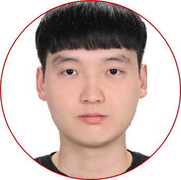 |
| 재단, 계좌, 결제 | 캠페인, 후원, 트리 | 회원, 거래, 채팅, 알림 |

 

### 백엔드

| 권용진 | 이유승 | 신재민 |
|:------:|:------:|:------:|
|  |  |  |
| CI/CD, 인증, 인가, 거래, 알림 | 블록체인, 금융, 후원 | 채팅, 재단, 캠페인 |
